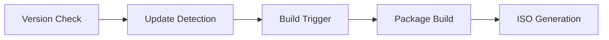

# APKG Software Recipe Helper 🛠️

[](https://opensource.org/licenses/MIT)
<!-- [](https://github.com/AzusaOS/azusa-recipes-helper/actions/workflows/version-check.yml)
-->

A comprehensive toolset for managing software recipes and versions in the AzusaOS ecosystem. This helper provides automated version checking, build triggers, and package management support for the APKG system.

## 📋 Features

- **Automated Version Checking**: Integrates with nvchecker for real-time software version monitoring
- **Database Management**: Supports multiple formats for package information:
  - CSV format (`VERSIONS.csv`)
  - Markdown documentation (`VERSIONS.md`)
  - JSON data structures
  - nvchecker configuration templates
- **Build Automation**: Triggers builds when new software versions are detected
- **ISO Generation**: Automated AzusaOS ISO creation through GitHub Actions
- **Docker Integration**: Containerized build environments and testing

## 🔧 Components

### Core Files
- `NVChecker.toml`: Version checking configuration
- `VERSIONS.csv`: Package version database
- `VERSIONS.md`: Human-readable package documentation
- `scripts/`: Automation and helper scripts

### Integration
- `azusa-opensource-recipes` (submodule)
- GitHub Actions workflows
- Docker build environments

## 🚀 Getting Started

### Prerequisites
```bash
# Install required tools
pip install nvchecker
```

### Basic Usage
1. Clone the repository:
```bash
git clone --recursive https://github.com/AzusaOS/azusa-recipes-helper.git
cd azusa-recipes-helper
```

2. Update package versions:
```bash
nvchecker -c NVChecker.toml
```

3. Generate reports: [WIP:Draft]
```bash
./scripts/generate-report.sh
```

## 🔄 Automated Workflows [WIP:Draft]

### Version Checking
- Scheduled checks via GitHub Actions
- Automated PR creation for version updates
- Integration with nvchecker

### Build Pipeline


## 🤝 Related Projects

- [AzusaOS](https://github.com/azusaOS/) - Main operating system project
- [azusa-opensource-recipes](https://github.com/AzusaOS/azusa-opensource-recipes/) - Package recipes
- [azusa-run](https://github.com/AzusaOS/azusa-run) - Runtime environment
- [azusa-docker](https://github.com/AzusaOS/azusa-docker) - Docker configurations
- [apkg](https://github.com/AzusaOS/apkg) - Package management system

## 📝 TODO

- [ ] Implement automatic version checking with nvchecker
  - [ ] Set up cronjob scheduling
  - [ ] Configure GitHub Actions workflow
- [ ] Create build automation system
  - [ ] Shell script templates
  - [ ] nvchecker integration
  - [ ] GitHub Actions configuration
- [ ] Develop ISO generation pipeline
  - [ ] Automated build process
  - [ ] Testing framework
- [ ] Docker integration
  - [ ] Build environment containers
  - [ ] Testing containers
  - [ ] CI/CD pipeline

## 📜 License

This project is licensed under the MIT License - see the [LICENSE](LICENSE) file for details.

## 🤝 Contributing

Contributions are welcome! Please feel free to submit a Pull Request.

1. Fork the repository
2. Create your feature branch (`git checkout -b feature/AmazingFeature`)
3. Commit your changes (`git commit -m 'Add some AmazingFeature'`)
4. Push to the branch (`git push origin feature/AmazingFeature`)
5. Open a Pull Request

## 📞 Contact

- Project Link: [https://github.com/AzusaOS/azusa-recipes-helper](https://github.com/AzusaOS/azusa-recipes-helper)
